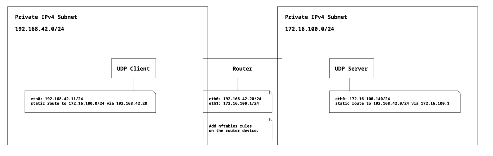
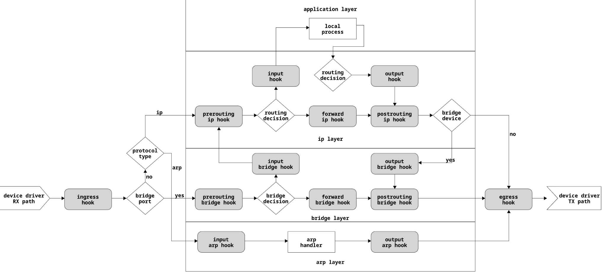

# Lab BSY Networking
Solution by guentgia.

## Task 1 – Setup & Basic Tasks
We want to build the following networking situation:



There are several ways of doing this. One is to instantiate three machines, virtual or not, and use
networking facilities. A second is using containers, Docker etc. In this lab we will use netspaces on a
single Openstack VM. To do this we need:

1. Ensure nftables is installed
2. Download a repo with a set of bash script files that will setup the name spaces

Make sure nftables is installed. Type:
```bash
$ nft --version
```

If nft is not installed then do so using:
```bash
$ sudo apt install nftables
```

Clone the appropriate repo using your ZHAW username/password and:

```bash
git clone https://github.zhaw.ch/InES-RT-Ethernet/bsy-lab-ip-route-students.git
```

After successful cloning call:

```bash
$ cd bsy-lab-ip-route-students/netenv
$ sudo bash netenv setup
```

This will set up a networking environment with three IP stacks running, each in its own namespace (golden-\<xyz>). For the purposes of this lab this setup is functionally equivalent to having three separate virtual machines or three networked docker images on one machine. Netspaces are sometimes used by hypervisors to separate network accesses by different guests and by containers for the same reason. Netspaces are also useful in setting up small networking environments for test and development purposes. When you are finished or want to start the lab again, you can delete the instances by using:

```bash
$ sudo bash netenv teardown
```

You can access ip features in the context of the namespaces, for instance:

```bash
$ sudo ip netns exec golden-router bash
```

Replace router with client or server to access the respective namespace

## Task 2 – Routing

### Subtask 2.1 – Setting up the routing

Enter the router namespace and - using the ip utility - examine the routing table. The ip utility features a number of sub-utilities, for instance link, route, address (addr), monitor.

First, we need to examine the routing table on the router:
```bash
$ sudo ip netns exec golden-router ip route list
172.16.100.0/24 dev enp0s9 proto kernel scope link src 172.16.100.1
192.168.42.0/24 dev enp0s8 proto kernel scope link src 192.168.42.20
```

Using the ping utility, are the client and server reachable? To ping from router to client and server to verify connectivity, run:
```bash
$ sudo ip netns exec golden-router ping 192.168.42.11
PING 192.168.42.11 (192.168.42.11) 56(84) bytes of data.
64 bytes from 192.168.42.11: icmp_seq=1 ttl=64 time=0.373 ms
64 bytes from 192.168.42.11: icmp_seq=2 ttl=64 time=0.052 ms
64 bytes from 192.168.42.11: icmp_seq=3 ttl=64 time=0.076 ms
^C
--- 192.168.42.11 ping statistics ---
3 packets transmitted, 3 received, 0% packet loss, time 2025ms
rtt min/avg/max/mdev = 0.052/0.167/0.373/0.145 ms
```
To ping from router to server to verify connectivity, run:
```bash
$ sudo ip netns exec golden-router ping 172.16.100.140
PING 172.16.100.140 (172.16.100.140) 56(84) bytes of data.
64 bytes from 172.16.100.140: icmp_seq=1 ttl=64 time=0.273 ms
64 bytes from 172.16.100.140: icmp_seq=2 ttl=64 time=0.052 ms
64 bytes from 172.16.100.140: icmp_seq=3 ttl=64 time=0.054 ms
^C
--- 172.16.100.140 ping statistics ---
3 packets transmitted, 3 received, 0% packet loss, time 2034ms
rtt min/avg/max/mdev = 0.052/0.126/0.273/0.103 ms
```

If you don't get replies, check your IP and routing configurations again.
Using the ping utility on the client, are the router and server reachable and if not why?

```bash
$ sudo ip netns exec golden-client ping 192.168.42.20
PING 192.168.42.20 (192.168.42.20) 56(84) bytes of data.
64 bytes from 192.168.42.20: icmp_seq=1 ttl=64 time=0.256 ms
64 bytes from 192.168.42.20: icmp_seq=2 ttl=64 time=0.096 ms
64 bytes from 192.168.42.20: icmp_seq=3 ttl=64 time=0.050 ms
^C
--- 192.168.42.20 ping statistics ---
3 packets transmitted, 3 received, 0% packet loss, time 2027ms
rtt min/avg/max/mdev = 0.050/0.134/0.256/0.088 ms
```

```bash
$ sudo ip netns exec golden-client ping 172.16.100.140
ping: connect: Network is unreachable
```

We do not have a route to the other subnet, so the server is unreachable for the client.
Now, to setup a static route from client to router, use the following command in the client namespace:

```bash
$ sudo ip netns exec golden-client ip route add 172.16.100.0/24 via 192.168.42.20 dev enp0s8
```

To validate the route, use:

```bash
$ sudo ip netns exec golden-client ip route list
172.16.100.0/24 via 192.168.42.20 dev enp0s8
192.168.42.0/24 dev enp0s8 proto kernel scope link src 192.168.42.11
```

Ping again, what happens and why?

```bash
$ sudo ip netns exec golden-client ping 172.16.100.140
PING 172.16.100.140 (172.16.100.140) 56(84) bytes of data.
^C
--- 172.16.100.140 ping statistics ---
4 packets transmitted, 0 received, 100% packet loss, time 3056ms
```

When the client sends a ping packet to the server, it is able to reach the server because we have added a static route on the client. The static route tells the client to send any packets for 172.16.100.0/24 to the router (192.168.42.20), and the router knows to forward them to the server because of its directly connected route on its 172.16.100.1 interface.

However, when the server tries to reply, it doesn't know how to route packets back to the client's IP (192.168.42.11) because it is on a different subnet (192.168.42.0/24) and there's no route for that subnet in the server's routing table. So, the reply packets are likely getting dropped, causing the ping to fail.

Now we want to setup a static route on the server, too:

```bash
$ sudo ip netns exec golden-server ip route add 192.168.42.0/24 via 172.16.100.1 dev enp0s8
```

```bash
$ sudo ip netns exec golden-server ip route list
172.16.100.0/24 dev enp0s8 proto kernel scope link src 172.16.100.140
192.168.42.0/24 via 172.16.100.1 dev enp0s8
```

Now, to enable routing (IP forwarding) on the router, run:

```bash
$ sudo ip netns exec golden-router bash -c 'echo "1" > /proc/sys/net/ipv4/ip_forward'
$ sudo ip netns exec golden-router cat /proc/sys/net/ipv4/ip_forward
1
```

Now, you should be able to ping between the client and server through the router. To verify, run:

```bash
$ sudo ip netns exec golden-client ping 172.16.100.140
PING 172.16.100.140 (172.16.100.140) 56(84) bytes of data.
64 bytes from 172.16.100.140: icmp_seq=1 ttl=63 time=0.468 ms
64 bytes from 172.16.100.140: icmp_seq=2 ttl=63 time=0.058 ms
64 bytes from 172.16.100.140: icmp_seq=3 ttl=63 time=0.098 ms
^C
--- 172.16.100.140 ping statistics ---
3 packets transmitted, 3 received, 0% packet loss, time 2051ms
rtt min/avg/max/mdev = 0.058/0.208/0.468/0.184 ms
```

```bash
$ sudo ip netns exec golden-server ping 192.168.42.11
PING 192.168.42.11 (192.168.42.11) 56(84) bytes of data.
64 bytes from 192.168.42.11: icmp_seq=1 ttl=63 time=0.134 ms
64 bytes from 192.168.42.11: icmp_seq=2 ttl=63 time=0.095 ms
64 bytes from 192.168.42.11: icmp_seq=3 ttl=63 time=0.062 ms
^C
--- 192.168.42.11 ping statistics ---
3 packets transmitted, 3 received, 0% packet loss, time 2028ms
rtt min/avg/max/mdev = 0.062/0.097/0.134/0.029 ms
```

If everything is set up correctly, you should now be able to get ping replies. If not, re-check your configuration and make sure IP forwarding is enabled on the router.

### Subtask 2.2 – Running the application

On the server machine, issue the command:
```bash
$ sudo ip netns exec golden-server bash
root@bsy-net:/home/ubuntu# cd bsy-lab-ip-route-students/
root@bsy-net:/home/ubuntu# ./srvr/bin/srvr
```

On the client machine, issue the command:

```bash
$ sudo ip netns exec golden-client bash
root@bsy-net:/home/ubuntu# cd bsy-lab-ip-route-students/
root@bsy-net:/home/ubuntu# ./clnt/bin/clnt
==========================================================
 Client sending number:                                 0
 Incremented number, received from the server:          1
 The packet round trip time was:              749.802 us.
==========================================================
==========================================================
 Client sending number:                                 1
 Incremented number, received from the server:          2
 The packet round trip time was:              312.912 us.
==========================================================
==========================================================
 Client sending number:                                 2
 Incremented number, received from the server:          3
 The packet round trip time was:              294.370 us.
==========================================================
```

The client part of the round-trip application automatically stops after the incrementing number has reached a value of 1000. If desired, the client can just be restarted and the sequence starts over again.

When running, the server as well as the client part of the round trip application can be stopped by hitting Ctrl + C on the respective console.

## Task 3 – Setting up Netfilter rules

netfilter - name of the subsystem within the linux kernel that allows access, through hooks, to packets traversing between interfaces.

netlink socket - the socket interface through which user-land processes can communicate with the netfilter.

nftables (nft) - the user space front-end utility used to configure the netfilter subsystem.

The netfilter subsystem of the Linux kernel can be configured from user space through netlink sockets. The user space front-end which is used to configure the netfilter subsystem is called nftables or just nft. The nft front-end unites and, at the same time, replaces the front-ends: iptables, ip6tables, arptables as well as ebtables. Hence, one has one and the same application to configure network filtering rules at all the possible hook-in points from an operating system point of view, e.g. even before entering the IP networking protocol stack of the operating system.

In the scope of this laboratory, the aim is to set up a packet counter which counts the UDP network packets that stem from the UDP round-trip application. A counter that should count ingress packets at the network interfaces of the router which are connected to the two distinct private IPv4 subnets, see also fig. 1. On the transport layer, the application uses the user datagram protocol (UDP). The application identifying characteristic is the static server port number that is 42000. The packets shall be counted before they enter the internet protocol (IP) networking protocol stack of the operating system. I.e. right after the packets are passed from the networking driver to the operating system.

### Subtask 3.1 – Understanding the structure of netfilters and nft



In the man page of nft, compare the hooks mentioned in the “Address Families” section with the diagram above. Relate the address families and hooks from the man page to the diagram above. Note: the availability of the netdev egress hook is nft version dependent.

Trace the path of the client UDP frame through the netfilter. Where would be a good place to set up a counter counting all frames entering the netfilter? Where would be a good place to set up counters for the following:

1. Counting all UDP frames entering the IP layer from an external port
2. Counting all UDP frames coming from an application
3. Counting the sum of frames from these two sources?

When a packet is received by the network interface (NIC), it's handed over to the Linux network subsystem which contains several points where we can intercept and manipulate the packet. These points are referred to as hooks. There are five main hooks:

- NF_IP_PRE_ROUTING: This hook is triggered when the packet just arrives at the network interface before any routing decisions are made.
- NF_IP_LOCAL_IN: This hook is triggered after a packet is routed if it is destined for the local machine.
- NF_IP_FORWARD: This hook is triggered if a packet is determined to be for another destination and needs to be forwarded.
- NF_IP_POST_ROUTING: This hook is triggered just before the packet is about to exit the network interface.
- NF_IP_LOCAL_OUT: This hook is triggered when the local machine sends out a packet.

These hooks are associated with the Ingress and Egress traffic at different points, and can be used to set up counters for different types of frames. Let's answer your questions considering these hooks:

1. Counting all UDP frames entering the IP layer from an external port: Here, you should use the NF_IP_PRE_ROUTING hook, as it intercepts packets as they arrive at the network interface, before any routing decisions have been made.

2. Counting all UDP frames coming from an application: Here, you should use the NF_IP_LOCAL_OUT hook, as it intercepts packets that are being sent out from the local machine.

3. Counting the sum of frames from these two sources: To get the sum of frames from both sources, you would need to combine the counters from the NF_IP_PRE_ROUTING and NF_IP_LOCAL_OUT hooks.

### Subtask 3.2 – Setting up a netdev counter

Let’s count frames coming into the netfilter. To do this nft offers a counter facility and counters need to be instantiated. The counters are triggered by a rule. Since in the wider scheme of things there can be many rules, rules need to be organized and are done so in chains. The chains are stored in a table which is address family specific.

So we need to set up a table. Given the table we can set up a counter and we can set up a chain. Once a rule is associated with a chain we can associate the rule with the counter. Awkward but there you have it.

On the router machine we set up a table and an associated named counter - we look at client-sided ingress - it is important you take the time to understand the syntax.

```bash
$ sudo ip netns exec golden-router bash
root@bsy-net:/home/ubuntu# nft add table netdev tbl-lowlevel-cnt
```

After every action on this table you can view the effect by using:
```bash
root@bsy-net:/home/ubuntu# nft list ruleset
```

We add the counter using:
```bash
root@bsy-net:/home/ubuntu# nft add counter netdev tbl-lowlevel-cnt round-trip-from-clnt
```

The name of the table and counter can be arbitrarily selected. In this case, the name:
tbl-lowlevel-cnt and round-trip-from-clnt was respectively chosen.

Now we setup a chain:
```bash
root@bsy-net:/home/ubuntu# nft add chain netdev tbl-lowlevel-cnt udp-ping '{ type filter hook ingress device enp0s8 priority -300; policy accept; }'
```

Finally we set up a rule:
```bash
root@bsy-net:/home/ubuntu# nft add rule netdev tbl-lowlevel-cnt udp-ping udp dport 42000 counter name round-trip-from-clnt
```

Run the client and server application again. Use nft list ruleset to view the state of the counters.

```bash
$ sudo ip netns exec golden-server bash
root@bsy-net:/home/ubuntu# cd bsy-lab-ip-route-students/
root@bsy-net:/home/ubuntu/bsy-lab-ip-route-students# ./srvr/bin/srvr
```

```bash
$ sudo ip netns exec golden-client bash
root@bsy-net:/home/ubuntu# cd bsy-lab-ip-route-students/
root@bsy-net:/home/ubuntu/bsy-lab-ip-route-students# ./clnt/bin/clnt
==========================================================
 Client sending number:                                 0
 Incremented number, received from the server:          1
 The packet round trip time was:              374.363 us.
==========================================================
==========================================================
 Client sending number:                                 1
 Incremented number, received from the server:          2
 The packet round trip time was:              149.373 us.
==========================================================
==========================================================
 Client sending number:                                 2
 Incremented number, received from the server:          3
 The packet round trip time was:              212.062 us.
==========================================================
```

```bash
$ sudo ip netns exec golden-router bash
root@bsy-net:/home/ubuntu# nft list ruleset
table netdev tbl-lowlevel-cnt {
        counter round-trip-from-clnt {
                packets 13 bytes 598
        }

        chain udp-ping {
                type filter hook ingress device "enp0s8" priority -300; policy accept;
                udp dport 42000 counter name "round-trip-from-clnt"
        }
}
```

### Subtask 3.3 – Comfortable debugging

We can also add a rule to monitor whenever a chain is traversed:

```bash
$ nft add rule netdev tbl-lowlevel-cnt udp-ping meta nftrace set 1
```

Check how the table is changed by this command:

```bash
$ nft list ruleset
```

To have live tracing, use:

```bash
$ nft monitor trace
```

### Subtask 3.4 – Exercise

Set up a counter on the postrouting hook in the ip address family.

The nftables framework offers the capability to count packets (and bytes) passing through a rule. Counters in nftables are rules that have the counter keyword. To set up a counter on the postrouting hook in the ip address family, follow the steps below:

1. Firstly, create a new table in the router namespace. The table will be linked with the ip address family.

```bash
$ sudo ip netns exec golden-router bash
root@bsy-net:/home/ubuntu# nft add table ip tbl-postrouting
```

2. Then, add a new chain to the tbl-postrouting table. The chain will be attached to the postrouting hook and it will have a priority of 0.

```bash
root@bsy-net:/home/ubuntu# nft add chain ip tbl-postrouting postrouting-chain '{ type filter hook postrouting priority 0; policy accept; }'}
```

3. Now, create a counter:

```bash
root@bsy-net:/home/ubuntu# nft add counter ip tbl-postrouting postrouting-counter
```

4. Finally, add a rule to the postrouting-chain that links it with the postrouting-counter.

```bash
root@bsy-net:/home/ubuntu# nft add rule ip tbl-postrouting postrouting-chain udp dport 42000 counter name "postrouting-counter"
```

Now, we have a chain in the ip table (which means it is applicable to IPv4 traffic), which is applied to packets after the routing decision has been made (due to the postrouting hook), and it will count packets destined to UDP port 42000.

To check the status of your ruleset, you can run:

```bash
root@bsy-net:/home/ubuntu# nft list ruleset
table ip tbl-postrouting {
        counter postrouting-counter {
                packets 0 bytes 0
        }

        chain postrouting-chain {
                type filter hook postrouting priority filter; policy accept;
                udp dport 42000 counter name "postrouting-counter"
        }
}
```

This will show you all tables, chains, rules, and counters you've set up.

Now let us see what happens if we start the application again:

```bash
$ sudo ip netns exec golden-server bash
root@bsy-net:/home/ubuntu# cd bsy-lab-ip-route-students/
root@bsy-net:/home/ubuntu/bsy-lab-ip-route-students# ./srvr/bin/srvr
```

```bash
$ sudo ip netns exec golden-client bash
root@bsy-net:/home/ubuntu# cd bsy-lab-ip-route-students/
root@bsy-net:/home/ubuntu/bsy-lab-ip-route-students# ./clnt/bin/clnt
==========================================================
 Client sending number:                                 0
 Incremented number, received from the server:          1
 The packet round trip time was:              374.363 us.
==========================================================
==========================================================
 Client sending number:                                 1
 Incremented number, received from the server:          2
 The packet round trip time was:              149.373 us.
==========================================================
==========================================================
 Client sending number:                                 2
 Incremented number, received from the server:          3
 The packet round trip time was:              212.062 us.
==========================================================
```

```bash
$ sudo nft list ruleset
table ip tbl-postrouting {
        counter postrouting-counter {
                packets 10 bytes 460
        }

        chain postrouting-chain {
                type filter hook postrouting priority filter; policy accept;
                udp dport 42000 counter name "postrouting-counter"
        }
}
```

The new counter rule counts the packets correctly!
